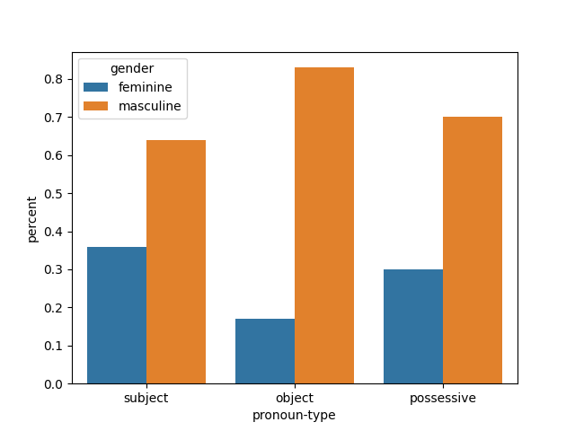
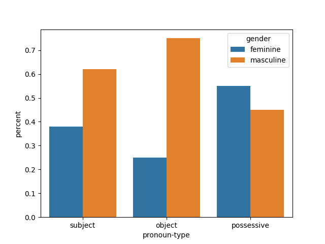

# The Glass Ceiling in Science Fiction

## Introduction

This project looks at masculine and feminine pronouns in a couple of famous science fiction works, "Dune", written by Frank Herbert and "Parable of the Sower" by Octavia E. Butler.  Science fiction has historically been a male-dominated field.  I was curious to see the difference in distribution in masculine and feminine subject, object, and possessive pronouns between
the works of a male vs female science fiction writer.

## Methodology

The datasets were corpora obtained from extracting text from PDFs of each book found on the internet.  The text was extracted using the pypdf python library.  After the text was extracted, the files were uploaded to my public repository for later use.

To do the analysis, SparkNLP needs to be loaded.  I used the following steps:

* Using Google Colab, I used the Johnsnowlabs SparkNLP colab script to load PySpark 3.2.3 and Spark NLP 5.4.1 into the Colab environment.
* Create a pretrained pipeline using the "explain_document_ml"

After the above steps, we are ready to annotate text.  I took the following steps to count pronouns in the books:

* Download the books into separate variables
* Loop through the book line by line
  * Annotate the line
  * Count the number of masculine object, subject, and possessive pronouns** in separate count variables
  * Count the number of feminine object, subject, and possessive pronouns** in separate count variables
* Return the counts of the pronouns found

After the counts were created, I could perform a significance test for the following:

* feminine vs masculine subject pronouns in *Dune*
* feminine vs masculine object pronouns in *Parable of the Sower*
* feminine vs masculine possessive pronouns** in *Dune*
* feminine vs masculine possessive pronouns** in *Parable of the Sower*

** I decided to look at possessive pronouns after looking at the counts of subject and object pronouns, just out of curiosity.

Code for the above count methodology was saved in Dune_Parable_of_the_Sower_SparkNLP.ipynb

## The Hypothesis

My hypothesis before looking at the data was that *Parable of the Sower* would have a significantly greater amount of feminine pronouns in at least one of the subject or object pronoun category.  Since there is no real guideline for what a significant difference in pronoun counts between books, I am deciding on a p-value of 0.05.  A calculated p-value less than 0.05 will mean a statistically significant difference.

## Evaluation

The following counts were obtained from the Colab file Dune_Parable_of_the_Sower_SparkNLP.ipynb

|    | Subject| Object | Possessive |
|----|----|--------|------------|
|Feminine  |    1490 | 190*** | 963***     |
|Masculine |    2655 | 950    | 2250       |

**Table 1:** *Dune* Pronoun Counts

|    | Subject | Object | Possessive |
|----|---------|--------|------------|
|Feminine  | 615     | 137*** | 452***     |
|Masculine | 1023    | 408    | 370        |

**Table 2:** *Parable of the Sower* Pronoun Counts



**Figure 1:** *Dune* Pronoun Percentages


**Figure 2:** *Parable of the Sower* Pronoun Percentages


The following code was used to test the significance between Subject, Object, and Possessive pronouns:

```
import scipy.stats as stats

# Feminine vs Masculine Subject Pronouns in Dune
print(stats.chisquare([1490, 2655], f_exp=[2072.5, 2072.5]))
# Feminine vs Masculine Object Pronouns in Dune
print(stats.chisquare([190, 950], f_exp=[570, 570]))
# Feminine vs Masculine Possessive Pronouns in Dune
print(stats.chisquare([963, 2250], f_exp=[1606.5, 1606.5]))
# Feminine vs Masculine Subject Pronouns in Parable of the Sower
print(stats.chisquare([615, 1023], f_exp=[819, 819]))
# Feminine vs Masculine Object Pronouns in Parable of the Sower 
print(stats.chisquare([137, 408], f_exp=[272.5, 272.5]))
# Feminine vs Masculine Pronouns in Pronouns in Parable of the Sower 
print(stats.chisquare([370, 452], f_exp=[411, 411]))
```

Produces the following output:

```angular2html
Power_divergenceResult(statistic=327.4366706875754, pvalue=3.4760851653738244e-73)
Power_divergenceResult(statistic=506.6666666666667, pvalue=3.368659961081157e-112)
Power_divergenceResult(statistic=515.5210084033613, pvalue=3.9903763586286385e-114)
Power_divergenceResult(statistic=101.62637362637362, pvalue=6.704665514800935e-24)
Power_divergenceResult(statistic=134.75412844036697, pvalue=3.7369446877800325e-31)
Power_divergenceResult(statistic=8.180048661800486, pvalue=0.004235362395417421)
```
All p-values are less than the pre-established 0.05 value, so all count differences are significant.

*** A caviet with this analysis is that SparkNLP does not always accurately determine the object pronoun 'her' vs the possessive pronoun 'her'.  The counts are likely off somewhat and this affects the significance tests.

